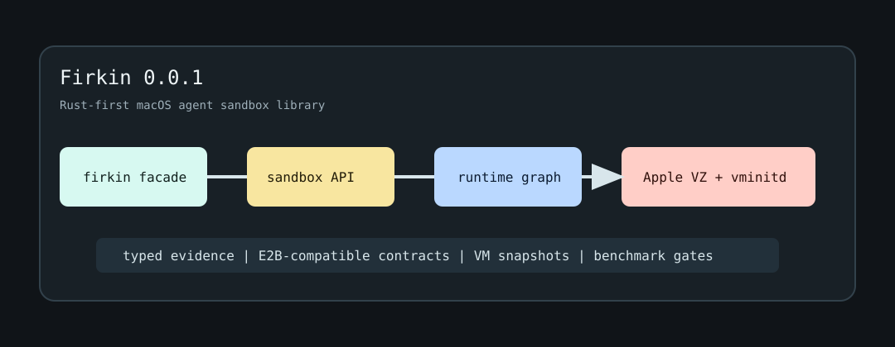

# Firkin

Firkin is an alpha Rust library for running agent sandboxes on macOS with Apple
Virtualization.framework. It packages the Firkin Rust workspace as a standalone
`delightful-ai/firkin` project: library crates first, signed live macOS runtime
proofs when you opt into them, and no Swift service payload.



> `0.0.3` is still pre-1.0 and intentionally unstable. The crate graph is publishable, but
> public APIs, runtime artifact distribution, and the agent-sandbox control
> surface can still change without compatibility shims.

## What Ships Here

- `firkin` facade crate for the current Rust API surface.
- `firkin-sandbox` public sandbox law surface for agent-oriented callers.
- `firkin-single-node` Apple/VZ single-host runtime composition.
- `firkin-runtime`, `firkin-core`, `firkin-vmm`, `firkin-vminitd-client`,
  `firkin-ext4`, `firkin-oci`, and supporting typed/evidence crates.
- `fk`, a development CLI for benchmark validation, local E2B-compatible
  service experiments, and signed live runtime proof loops. The CLI is built by
  GitHub release workflows; it is not published to crates.io in this alpha.

This repository does not ship Apple's Swift `Containerization` package, the
Swift service implementation, or a Docker-compatible end-user CLI. The Rust
library keeps prior Apple/VZ behavior as design evidence, but the project
surface is Rust-first.

## Requirements

- Apple silicon Mac.
- macOS with Virtualization.framework support.
- Rust `1.95.0` from `rust-toolchain.toml`.
- Xcode command line tools for codesigning live VM test binaries.
- `protoc` for `firkin-vminitd-client` builds.

Fast CI and ordinary consumer builds do not embed local 100 MiB+ vminitd/vmexec
binaries. Live VM flows need pinned release URLs, `FIRKIN_VMINITD_PATH` plus
`FIRKIN_VMEXEC_PATH`, or a deliberately populated local runtime artifact cache.

## Quickstart

Library consumer:

```bash
cargo add firkin@0.0.3
```

Compile-only smoke:

```rust
use firkin::{Rootfs, RuntimeCapabilities, RuntimeCapability};
use firkin::types::{ContainerId, Size};

static SMOKE_CAPABILITIES: &[RuntimeCapability] = &[
    RuntimeCapability::supported("compile", Some("consumer smoke")),
];

fn main() {
    let id = ContainerId::new("agent-1").unwrap();
    let rootfs = Rootfs::raw_block("/tmp/rootfs.img");
    let caps = RuntimeCapabilities::new("external-smoke", SMOKE_CAPABILITIES, &[]);

    assert_eq!(id.as_str(), "agent-1");
    assert!(matches!(rootfs, Rootfs::RawBlock { .. }));
    assert!(caps.supports("compile"));
    assert_eq!(Size::mib(1).as_bytes(), 1024 * 1024);
}
```

Repository development:

```bash
brew install protobuf
rustup toolchain install 1.95.0 --profile minimal --component clippy --component rustfmt

cargo check --workspace --all-targets
cargo test --workspace
cargo run -p firkin-cli -- benchmark list
```

The default embedded-vminitd build is deliberately strict. It fails if the
pinned runtime artifacts are unavailable rather than silently using unverified
guest binaries.

## Minimal API Sketch

```rust,no_run
use firkin::sandbox::{SandboxBackend, SandboxCreateRequest};
use firkin::types::{SandboxId, TemplateId};

async fn create<B: SandboxBackend>(backend: &B) -> Result<(), B::Error> {
    let request = SandboxCreateRequest::builder(
        SandboxId::new("agent-1").unwrap(),
        TemplateId::new("base").unwrap(),
    )
    .build();

    let sandbox = backend.create(request).await?;
    sandbox.run("python -V").await?;
    Ok(())
}
```

The exact API is still alpha. Prefer the crate docs and examples under
`crates/firkin/examples/` over copying this sketch blindly.

## Live macOS Proofs

VM-backed tests must be signed with the Virtualization entitlement before they
can talk to VZ:

```bash
just live-apple-vz-core-smoke
just live-runtime-benchmark-slo-gate
```

The helper signs test binaries with `signing/vz.entitlements`. Live tests are
environment-sensitive: disk pressure, local VM state, codesigning, and missing
vminitd/vmexec artifacts should be treated as setup failures, not proof that
the library works.

## Crate Map

```text
firkin / firkin-cli
  -> firkin-benchmark, firkin-single-node
  -> firkin-runtime
  -> firkin-core, firkin-sandbox
  -> firkin-vmm, firkin-vminitd-client, firkin-oci, firkin-ext4, firkin-vsock
  -> firkin-trace, firkin-types
```

The detailed topology contract lives in
[`docs/specs/rust_rewrite/10-post-split-crate-topology.md`](docs/specs/rust_rewrite/10-post-split-crate-topology.md).

## Publishing Status

`0.0.3` is published in dependency order on crates.io. GitHub Actions
provide:

- `CI`: macOS Rust metadata, fmt, crate graph, check, clippy, tests, examples.
- `Package dry run`: package tarball checks for publishable crates.
- `Publish crates`: manual crates.io publish job using a `CRATES_IO_TOKEN`
  secret and the `crates-io` environment.
- `Release`: draft prerelease artifacts for `v0.0.3*` tags.

The concrete operator flows are also recorded as repo skills under
`.agents/skills/`.

## License and Attribution

Firkin is licensed under Apache-2.0. This repository includes Rust code and
design documentation derived from work in Apple's Containerization project;
historical notes under `docs/specs/rust_rewrite/` preserve source references
where they matter for behavior and design provenance.
